# Hierarchical Specialized Intelligence Swarm (HSIS)

<!-- Badges -->


**Transform ambiguous ideas into tested, deployable code through autonomous AI agent orchestration.**

---

## Why HSIS?

Building software with AI is powerful but chaotic. A single agent tries to do everything: gather requirements, design architecture, and write code. The result? Scope creep, inconsistent decisions, and untraceable logic.

**HSIS solves this with specialization and structure:**

| Problem | HSIS Solution |
|---------|---------------|
| AI agents hallucinate requirements | PM agent writes formal, testable PRDs |
| Architecture decisions are scattered | Architect agent creates traceable specifications |
| Code doesn't match design | Developer agent implements exactly what's specified |
| No audit trail | Every decision is documented with artifacts |
| Quality varies wildly | Gate validators enforce standards at each phase |

**The result:** Deterministic, auditable software development where every line of code traces back to a requirement.

---

## Architecture

```mermaid
flowchart LR
    subgraph Input
        REQ["Your Idea"]
    end

    subgraph PM["Gemini CLI"]
        direction TB
        PM_ROLE["Product Manager"]
        PM_OUT["PRD.md"]
    end

    subgraph ARCH["Codex CLI"]
        direction TB
        ARCH_ROLE["Architect"]
        ARCH_OUT["ARCHITECTURE.md<br/>IMPLEMENTATION_PLAN.md<br/>ADRs"]
    end

    subgraph DEV["Claude CLI"]
        direction TB
        DEV_ROLE["Developer"]
        DEV_OUT["/src + /tests<br/>IMPLEMENTATION_REPORT.md"]
    end

    subgraph Output
        DONE["Working Software"]
    end

    REQ --> PM
    PM -->|"PM Gate"| ARCH
    ARCH -->|"Architect Gate"| DEV
    DEV -->|"Developer Gate"| DONE

    style PM fill:#4285F4,color:#fff
    style ARCH fill:#10A37F,color:#fff
    style DEV fill:#D97706,color:#fff
```



**Data Flow:**
1. **You** write a plain-language requirement
2. **Gemini (PM)** creates a formal PRD with numbered requirements
3. **Codex (Architect)** designs the system architecture and implementation plan
4. **Claude (Developer)** implements exactly what's specified with tests
5. **Quality Gates** validate each phase before proceeding

---

## Quick Start (5 Minutes)

### Prerequisites

- Node.js v20+
- API Keys: [Anthropic](https://console.anthropic.com/), [OpenAI](https://platform.openai.com/), [Google AI](https://aistudio.google.com/)

### 1. Clone and Initialize

```bash
git clone https://github.com/yourusername/hsis-framework.git
cd hsis-framework
./scripts/init-swarm.sh
```

### 2. Configure API Keys

```bash
# Create credentials file
mkdir -p ~/.config/hsis
cat > ~/.config/hsis/credentials << 'EOF'
export ANTHROPIC_API_KEY="sk-ant-your-key"
export OPENAI_API_KEY="sk-your-key"
export GOOGLE_AI_API_KEY="AIza-your-key"
EOF
chmod 600 ~/.config/hsis/credentials

# Add to shell profile
echo '[ -f ~/.config/hsis/credentials ] && source ~/.config/hsis/credentials' >> ~/.bashrc
source ~/.bashrc
```

### 3. Run Your First Workflow

```bash
# Write your requirement
mkdir -p .swarm/intake
cat > .swarm/intake/hello-world.md << 'EOF'
# Hello World Feature
Create a simple "Hello World" API endpoint that returns a greeting message.
EOF

# Run the full swarm
./scripts/swarm-orchestrator.sh full
```

That's it! Check `docs/` for generated artifacts and `src/` for implementation.

---

## Documentation

| Document | Description |
|----------|-------------|
| [Configuration Guide](docs/CONFIGURATION.md) | API keys, environment setup, agent config |
| [Implementation Guide](HSIS_IMPLEMENTATION_GUIDE.md) | Complete reference with troubleshooting |
| [Contributing](docs/CONTRIBUTING.md) | How to contribute using HSIS itself |
| [Example Walkthrough](example2/WALKTHROUGH.md) | Step-by-step real example |

---

## Agent Roles

Each agent has strict boundaries defined by constraint files:

| Agent | Role | Model | Constraint File | Produces |
|-------|------|-------|-----------------|----------|
| Gemini | Product Manager | gemini-2.5-pro | [GEMINI.md](GEMINI.md) | PRD.md |
| Codex | Architect | GPT-5 Codex | [AGENTS.md](AGENTS.md) | ARCHITECTURE.md, IMPLEMENTATION_PLAN.md, ADRs |
| Claude | Developer | Opus 4.5 | [CLAUDE.md](CLAUDE.md) | /src, /tests, IMPLEMENTATION_REPORT.md |

**Key Principle:** Each agent can only do its job. PM cannot design architecture. Architect cannot write code. Developer cannot change requirements.

---

## Project Structure

<details>
<summary><strong>Click to expand directory structure</strong></summary>

```
hsis-framework/
├── scripts/                    # Orchestration scripts
│   ├── swarm-orchestrator.sh  # Main workflow controller
│   ├── init-swarm.sh          # Project initialization
│   ├── run-pm.sh              # PM phase runner
│   ├── run-architect.sh       # Architect phase runner
│   ├── run-developer.sh       # Developer phase runner
│   └── verify-gates.sh        # Gate validation
├── docs/
│   ├── templates/             # Artifact templates
│   │   ├── PRD-TEMPLATE.md
│   │   ├── ARCHITECTURE-TEMPLATE.md
│   │   └── ...
│   ├── CONFIGURATION.md       # Configuration guide
│   └── CONTRIBUTING.md        # Contribution guide
├── .swarm/                    # Workflow state (per-project)
│   ├── intake/                # Your requirements go here
│   ├── artifacts/             # Generated handoffs
│   ├── escalations/           # Blocker notes
│   └── status/                # Workflow state
├── example2/                  # Complete working example
│   ├── WALKTHROUGH.md         # Step-by-step guide
│   ├── docs/                  # Generated artifacts
│   ├── src/                   # Implemented code
│   └── tests/                 # Test suites
├── GEMINI.md                  # PM constraints
├── AGENTS.md                  # Architect constraints
├── CLAUDE.md                  # Developer constraints
├── HSIS_IMPLEMENTATION_GUIDE.md  # Full reference
└── README.md                  # This file
```

</details>

---

## Usage

```bash
# Full autonomous workflow
./scripts/swarm-orchestrator.sh full

# Run individual phases
./scripts/swarm-orchestrator.sh pm        # Requirements → PRD
./scripts/swarm-orchestrator.sh architect # PRD → Architecture
./scripts/swarm-orchestrator.sh developer # Architecture → Code

# Verify gates
./scripts/verify-gates.sh pm
./scripts/verify-gates.sh architect
./scripts/verify-gates.sh developer
```

---

## Quality Gates

Every phase must pass a gate before proceeding:

| Gate | Key Criteria |
|------|--------------|
| **PM Gate** | All requirements have IDs (FR-###), acceptance criteria defined, no contradictions |
| **Architect Gate** | Every requirement maps to design, API contracts complete, test strategy defined |
| **Developer Gate** | All tests pass, coverage >80%, lint/type checks pass, no security issues |

If a gate fails, the workflow loops back for corrections. See [Troubleshooting](HSIS_IMPLEMENTATION_GUIDE.md#14-troubleshooting) for common issues.

---

## Contributing

We use HSIS to build HSIS! See [CONTRIBUTING.md](docs/CONTRIBUTING.md) for guidelines on:

- Dog-fooding: Using the framework to contribute features
- Pull request process
- Commit conventions
- Quality requirements

---

## License

MIT - See [LICENSE](LICENSE)

---

## Acknowledgments

Built with:
- [Claude Code CLI](https://claude.ai) - Anthropic
- [Gemini CLI](https://ai.google.dev) - Google
- [Codex CLI](https://openai.com) - OpenAI

---

**Ready to build?** Start with the [Quick Start](#quick-start-5-minutes) or explore the [Example Walkthrough](example2/WALKTHROUGH.md).
