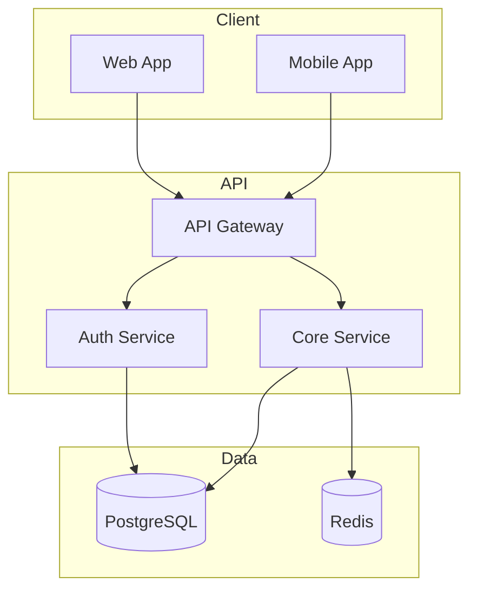

# Architecture Specification

## Document Information
| Field | Value |
|-------|-------|
| Title | [Project Name] Architecture |
| Date | [YYYY-MM-DD] |
| Version | 1.0 |
| Author | [Architect Name] |
| Status | Draft / Review / Approved |
| PRD Reference | docs/PRD.md v1.0 |

---

## 1. System Overview

### Purpose
[Brief description of the system's purpose and primary functions]

### Key Capabilities
- [Capability 1]
- [Capability 2]
- [Capability 3]

### Design Principles
1. [Principle 1]: [Brief explanation]
2. [Principle 2]: [Brief explanation]
3. [Principle 3]: [Brief explanation]

---

## 2. Architecture Diagram

### High-Level Architecture
```
┌─────────────────────────────────────────────────────────────────┐
│                         Client Layer                             │
│  ┌─────────────┐  ┌─────────────┐  ┌─────────────┐              │
│  │   Web App   │  │ Mobile App  │  │    CLI      │              │
│  │  (React)    │  │  (React    │  │             │              │
│  │             │  │   Native)   │  │             │              │
│  └──────┬──────┘  └──────┬──────┘  └──────┬──────┘              │
└─────────┼────────────────┼────────────────┼─────────────────────┘
          │                │                │
          └────────────────┼────────────────┘
                           │ HTTPS
                           ▼
┌─────────────────────────────────────────────────────────────────┐
│                        API Gateway                               │
│  ┌─────────────────────────────────────────────────────────┐    │
│  │  Rate Limiting │ Auth │ Routing │ Request Validation    │    │
│  └─────────────────────────────────────────────────────────┘    │
└──────────────────────────────┬──────────────────────────────────┘
                               │
          ┌────────────────────┼────────────────────┐
          │                    │                    │
          ▼                    ▼                    ▼
┌─────────────────┐  ┌─────────────────┐  ┌─────────────────┐
│  User Service   │  │ [Service 2]     │  │ [Service 3]     │
│                 │  │                 │  │                 │
│  - Auth         │  │  - [Function]   │  │  - [Function]   │
│  - Profile      │  │  - [Function]   │  │  - [Function]   │
│  - Permissions  │  │                 │  │                 │
└────────┬────────┘  └────────┬────────┘  └────────┬────────┘
         │                    │                    │
         └────────────────────┼────────────────────┘
                              │
                              ▼
┌─────────────────────────────────────────────────────────────────┐
│                       Data Layer                                 │
│  ┌─────────────┐  ┌─────────────┐  ┌─────────────┐              │
│  │ PostgreSQL  │  │   Redis     │  │    S3       │              │
│  │ (Primary)   │  │  (Cache)    │  │  (Files)    │              │
│  └─────────────┘  └─────────────┘  └─────────────┘              │
└─────────────────────────────────────────────────────────────────┘
```

### Mermaid Diagram (Alternative)


---

## 3. Component Responsibilities

| Component | Responsibility | Dependencies | Technology |
|-----------|---------------|--------------|------------|
| API Gateway | Request routing, rate limiting, auth | Auth Service | [Tech] |
| Auth Service | Authentication, authorization, tokens | Database | [Tech] |
| [Service 2] | [Primary responsibility] | [Dependencies] | [Tech] |
| [Service 3] | [Primary responsibility] | [Dependencies] | [Tech] |
| Database | Persistent data storage | None | PostgreSQL |
| Cache | Session and data caching | None | Redis |

### Component Details

#### API Gateway
- **Purpose**: Single entry point for all client requests
- **Responsibilities**:
  - Request routing
  - Rate limiting
  - Authentication verification
  - Request/response transformation
- **Interfaces**: REST over HTTPS
- **Scaling**: Horizontal with load balancer

#### Auth Service
- **Purpose**: Handle all authentication and authorization
- **Responsibilities**:
  - User authentication
  - Token generation and validation
  - Permission checking
- **Interfaces**: Internal gRPC, External REST
- **Scaling**: Horizontal, stateless

[Continue for each component...]

---

## 4. Data Models

### Entity Relationship Diagram
```
┌──────────────┐       ┌──────────────┐       ┌──────────────┐
│    User      │       │   [Entity2]  │       │   [Entity3]  │
├──────────────┤       ├──────────────┤       ├──────────────┤
│ id (PK)      │───┐   │ id (PK)      │───┐   │ id (PK)      │
│ email        │   │   │ user_id (FK) │◄──┘   │ [field] (FK) │◄──┐
│ password_hash│   │   │ [field]      │       │ [field]      │   │
│ created_at   │   │   │ [field]      │       │ created_at   │   │
│ updated_at   │   └──▶│ created_at   │       └──────────────┘   │
└──────────────┘       └──────────────┘                          │
                                                                  │
                       [Additional relationships...]              │
```

### Core Data Types

```typescript
// User Entity
interface User {
  id: string;           // UUID v4
  email: string;        // Unique, lowercase
  passwordHash: string; // bcrypt hash
  role: UserRole;       // enum: admin, user, guest
  profile: UserProfile;
  createdAt: Date;
  updatedAt: Date;
}

enum UserRole {
  ADMIN = 'admin',
  USER = 'user',
  GUEST = 'guest'
}

interface UserProfile {
  firstName: string;
  lastName: string;
  avatarUrl?: string;
}

// [Entity 2]
interface [Entity2] {
  id: string;
  userId: string;       // FK to User
  [field]: [type];
  createdAt: Date;
}

// Continue for all entities...
```

### Database Schema

```sql
-- Users table
CREATE TABLE users (
    id UUID PRIMARY KEY DEFAULT gen_random_uuid(),
    email VARCHAR(255) UNIQUE NOT NULL,
    password_hash VARCHAR(255) NOT NULL,
    role VARCHAR(50) NOT NULL DEFAULT 'user',
    created_at TIMESTAMP WITH TIME ZONE DEFAULT NOW(),
    updated_at TIMESTAMP WITH TIME ZONE DEFAULT NOW()
);

-- [Table 2]
CREATE TABLE [table_name] (
    id UUID PRIMARY KEY DEFAULT gen_random_uuid(),
    user_id UUID REFERENCES users(id) ON DELETE CASCADE,
    [column] [type] [constraints],
    created_at TIMESTAMP WITH TIME ZONE DEFAULT NOW()
);

-- Indexes
CREATE INDEX idx_users_email ON users(email);
CREATE INDEX idx_[table]_[column] ON [table]([column]);
```

---

## 5. API Contracts

### Base URL
- Development: `http://localhost:3000/api/v1`
- Production: `https://api.example.com/v1`

### Common Headers
```
Authorization: Bearer <token>
Content-Type: application/json
X-Request-ID: <uuid>
```

### Endpoints

#### POST /auth/register
**Description**: Create a new user account

**Request**:
```json
{
  "email": "user@example.com",
  "password": "SecureP@ss123",
  "firstName": "John",
  "lastName": "Doe"
}
```

**Response (201 Created)**:
```json
{
  "id": "uuid",
  "email": "user@example.com",
  "role": "user",
  "createdAt": "2024-01-15T10:30:00Z"
}
```

**Errors**:
| Status | Code | Description |
|--------|------|-------------|
| 400 | ERR_VALIDATION | Invalid input data |
| 409 | ERR_DUPLICATE | Email already exists |

---

#### POST /auth/login
**Description**: Authenticate user and get access token

**Request**:
```json
{
  "email": "user@example.com",
  "password": "SecureP@ss123"
}
```

**Response (200 OK)**:
```json
{
  "accessToken": "eyJhbG...",
  "refreshToken": "eyJhbG...",
  "expiresIn": 3600,
  "tokenType": "Bearer"
}
```

**Errors**:
| Status | Code | Description |
|--------|------|-------------|
| 401 | ERR_INVALID_CREDENTIALS | Wrong email or password |
| 429 | ERR_RATE_LIMITED | Too many attempts |

---

#### GET /users/{id}
**Description**: Get user by ID

**Path Parameters**:
- `id` (required): User UUID

**Response (200 OK)**:
```json
{
  "id": "uuid",
  "email": "user@example.com",
  "role": "user",
  "profile": {
    "firstName": "John",
    "lastName": "Doe"
  },
  "createdAt": "2024-01-15T10:30:00Z"
}
```

**Errors**:
| Status | Code | Description |
|--------|------|-------------|
| 401 | ERR_UNAUTHORIZED | Missing or invalid token |
| 403 | ERR_FORBIDDEN | Insufficient permissions |
| 404 | ERR_NOT_FOUND | User not found |

[Continue for all endpoints...]

### Error Response Format
```json
{
  "code": "ERR_CODE",
  "message": "Human-readable error message",
  "detail": "Additional diagnostic information",
  "traceId": "uuid-for-correlation"
}
```

---

## 6. Concurrency & Scaling Strategy

### Scaling Approach
| Component | Scaling Type | Min Instances | Max Instances | Trigger |
|-----------|--------------|---------------|---------------|---------|
| API Gateway | Horizontal | 2 | 10 | CPU > 70% |
| Auth Service | Horizontal | 2 | 8 | CPU > 70% |
| Database | Vertical + Read Replicas | 1 Primary | 3 Replicas | Connections > 80% |
| Cache | Cluster | 3 | 6 | Memory > 80% |

### Connection Pooling
```yaml
database:
  pool:
    min: 5
    max: 20
    idleTimeout: 30000
    connectionTimeout: 5000

redis:
  pool:
    min: 2
    max: 10
```

### Caching Strategy
| Data Type | Cache Location | TTL | Invalidation |
|-----------|----------------|-----|--------------|
| User sessions | Redis | 1 hour | On logout |
| [Data type 2] | Redis | [TTL] | [Strategy] |
| [Data type 3] | Local | [TTL] | [Strategy] |

### Rate Limiting
| Endpoint Category | Rate Limit | Window | Response |
|-------------------|------------|--------|----------|
| Authentication | 10 req | 1 minute | 429 |
| API (authenticated) | 100 req | 1 minute | 429 |
| API (unauthenticated) | 20 req | 1 minute | 429 |

---

## 7. Security Model

### Authentication
- **Method**: JWT (JSON Web Tokens)
- **Algorithm**: RS256
- **Access Token TTL**: 1 hour
- **Refresh Token TTL**: 7 days
- **Token Storage**: HttpOnly cookies (web), Secure storage (mobile)

### Authorization
| Role | Permissions |
|------|-------------|
| admin | All operations |
| user | Read/write own data, read public data |
| guest | Read public data only |

### Permission Matrix
| Resource | admin | user | guest |
|----------|-------|------|-------|
| GET /users | ✓ | Own only | ✗ |
| POST /users | ✓ | ✗ | ✗ |
| PUT /users/{id} | ✓ | Own only | ✗ |
| DELETE /users/{id} | ✓ | ✗ | ✗ |

### Secrets Management
- Environment variables for local development
- [Secret Manager Name] for production
- No secrets in code, logs, or version control
- Credential rotation policy: [frequency]

### Security Checklist
- [ ] Input validation on all endpoints
- [ ] Output encoding (XSS prevention)
- [ ] Parameterized queries (SQL injection prevention)
- [ ] CSRF tokens for state-changing operations
- [ ] Secure headers (HSTS, CSP, X-Frame-Options)
- [ ] TLS 1.3 for all connections
- [ ] Dependency vulnerability scanning

---

## 8. Observability

### Logging
**Format**: JSON structured logging
```json
{
  "timestamp": "2024-01-15T10:30:00.000Z",
  "level": "info",
  "service": "auth-service",
  "traceId": "uuid",
  "spanId": "uuid",
  "message": "User authenticated",
  "userId": "uuid",
  "duration": 45
}
```

**Log Levels**:
- `error`: Application errors, exceptions
- `warn`: Recoverable issues, deprecations
- `info`: Business events, state changes
- `debug`: Diagnostic information (dev only)

**Required Events**:
- [ ] Authentication success/failure
- [ ] Authorization denial
- [ ] API request/response (sanitized)
- [ ] Error occurrences
- [ ] [Custom business events]

### Metrics
| Metric | Type | Labels | Description |
|--------|------|--------|-------------|
| http_requests_total | Counter | method, path, status | Total HTTP requests |
| http_request_duration_seconds | Histogram | method, path | Request latency |
| active_users | Gauge | - | Currently active users |
| [custom_metric] | [type] | [labels] | [description] |

### Tracing
- **Protocol**: OpenTelemetry
- **Sampling Rate**: 10% (production), 100% (development)
- **Span Naming**: `{service}.{operation}`
- **Required Spans**:
  - HTTP request handling
  - Database queries
  - External API calls
  - Cache operations

### Alerting Rules
| Alert | Condition | Severity | Action |
|-------|-----------|----------|--------|
| High Error Rate | error_rate > 1% for 5m | Critical | Page on-call |
| High Latency | p95 > 500ms for 10m | Warning | Slack notification |
| Service Down | health_check fails 3x | Critical | Page on-call |

---

## 9. Performance Budget

| NFR ID | Metric | Target | Measurement Method |
|--------|--------|--------|-------------------|
| NFR-001 | API P95 Latency | ≤200ms | Load test with k6 |
| NFR-002 | Throughput | ≥1000 RPS | Load test with k6 |
| NFR-003 | Database Query Time | ≤50ms P95 | Query profiling |
| NFR-004 | Page Load Time | ≤2s | Lighthouse |
| NFR-005 | Time to First Byte | ≤100ms | Synthetic monitoring |

### Load Test Scenarios
1. **Normal Load**: 100 concurrent users, 10 RPS
2. **Peak Load**: 500 concurrent users, 100 RPS
3. **Stress Test**: 1000 concurrent users, ramp to failure

---

## 10. Migration/Rollout Plan

### Phase 1: Foundation
- Deploy infrastructure (database, cache, networking)
- Deploy API Gateway with health checks
- Smoke test with synthetic traffic

### Phase 2: Core Services
- Deploy Auth Service
- Deploy [Service 2]
- Integration testing

### Phase 3: Traffic Migration
- Enable canary deployment (5% traffic)
- Monitor for errors
- Gradually increase to 100%

### Rollback Procedure
1. Identify issue via monitoring/alerts
2. Execute rollback command: `[command]`
3. Verify previous version is serving
4. Investigate root cause
5. Fix and redeploy

---

## 11. Definition of Done

For implementation to be considered complete:

### Code Quality
- [ ] All components implemented per specification
- [ ] All API contracts implemented exactly
- [ ] Code follows established patterns
- [ ] No hardcoded secrets or credentials
- [ ] Error handling implemented per spec

### Testing
- [ ] Unit tests written (≥80% coverage)
- [ ] Integration tests written
- [ ] E2E tests for critical paths
- [ ] Load tests passing performance budget
- [ ] Security tests passing

### Documentation
- [ ] README updated with setup instructions
- [ ] API documentation generated
- [ ] CHANGELOG updated
- [ ] Implementation Report delivered

### Operations
- [ ] Logging implemented per spec
- [ ] Metrics exported
- [ ] Health checks implemented
- [ ] Deployment scripts tested

---

## 12. Requirement Mapping

| Requirement | Design Element(s) | Test(s) |
|-------------|-------------------|---------|
| FR-001 | Auth Service, POST /auth/register | tests/auth/register.test.ts |
| FR-002 | Auth Service, POST /auth/login | tests/auth/login.test.ts |
| FR-003 | User Service, GET /users/{id} | tests/users/get.test.ts |
| NFR-001 | Caching layer, DB indexing | tests/perf/latency.test.ts |
| NFR-002 | TLS configuration, JWT validation | tests/security/auth.test.ts |

---

## Architect Gate Checklist

Before handoff to Developer, verify:

- [ ] Every FR maps to at least one design element
- [ ] Every NFR maps to at least one design element
- [ ] Every FR has at least one test specified
- [ ] Every NFR has at least one test specified
- [ ] All interfaces/contracts fully specified
- [ ] API request/response schemas complete
- [ ] Error model defined for all endpoints
- [ ] Data models complete with types
- [ ] Security model documented
- [ ] All risks have mitigations
- [ ] Definition of Done is clear

**Gate Status**: [ ] PASS / [ ] FAIL
